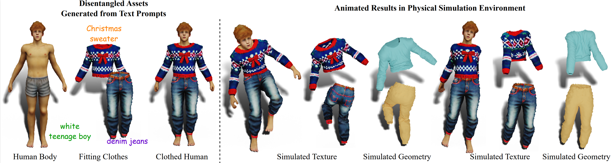
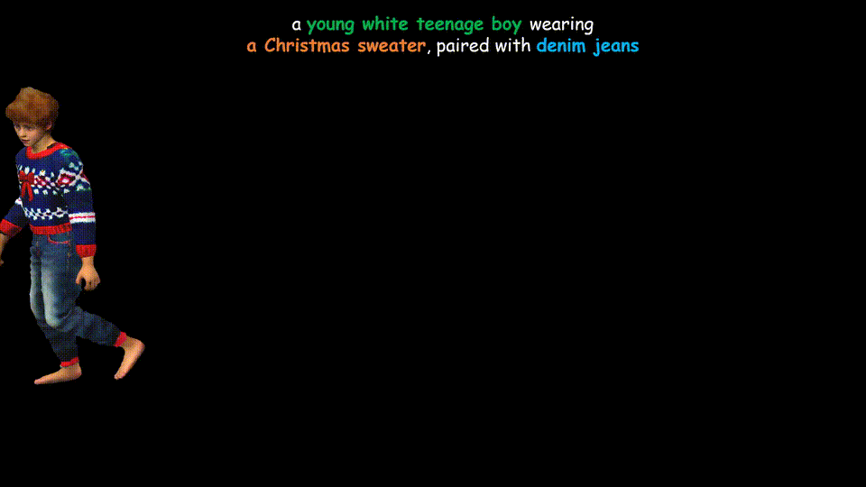
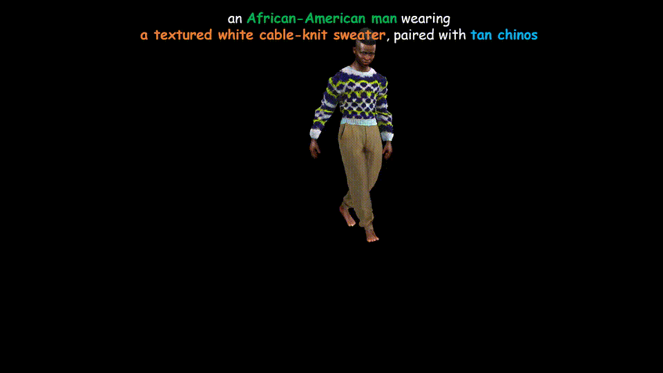
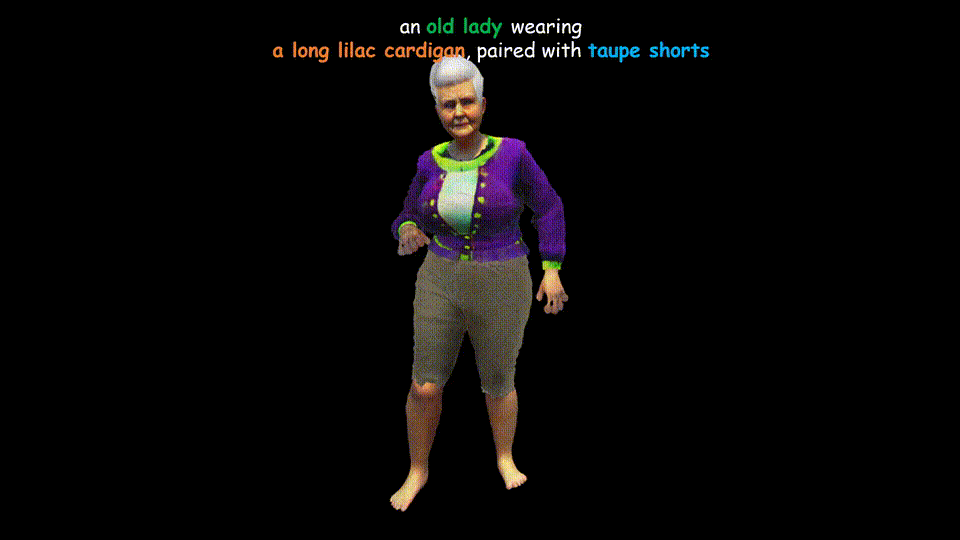
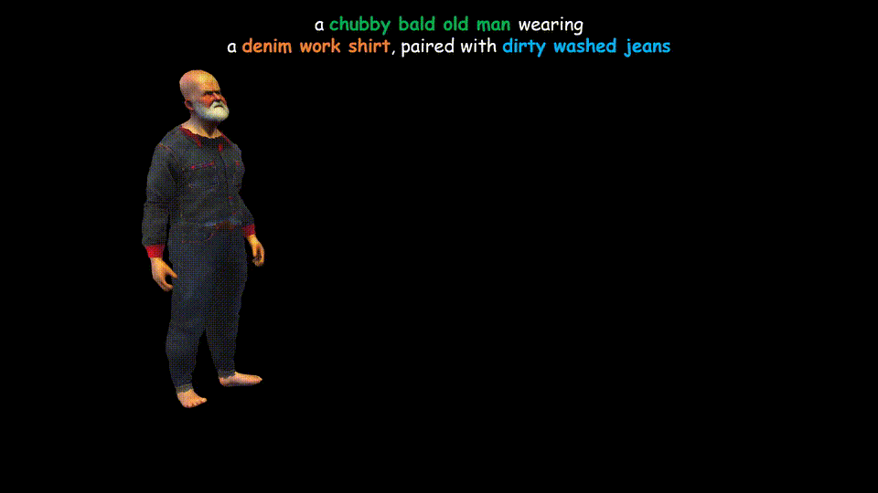

# SO-SMPL
Official Implementation of paper "Disentangled Clothed Avatar Generation from Text Descriptions"

**[Project Page](https://shanemankiw.github.io/SO-SMPL)** | **[Paper](https://shanemankiw.github.io/SO-SMPL)**

>In this paper, we introduced a novel text-to-avatar generation method that separately generates the human body and the clothes and allows high-quality animation on the generated avatar. While recent advancements in text-to-avatar generation have yielded diverse human avatars from text prompts, these methods typically combine all elements-clothes, hair, and body-into a single 3D representation. Such an entangled approach poses challenges for downstream tasks like editing or animation. To overcome these limitations, we propose a novel disentangled 3D avatar representation named Sequentially Offset-SMPL (SO-SMPL), building upon the SMPL model. SO-SMPL represents the human body and clothes with two separate meshes, but associates them with offsets to ensure the physical alignment between the body and the clothes. Then, we design an Score Distillation Sampling(SDS)-based distillation framework to generate the proposed SO-SMPL representation from text prompts. In comparison with existing text-to-avatar methods, our approach not only achieves higher exture and geometry quality and better semantic alignment with text prompts, but also significantly improves the visual quality of character animation, virtual try-on, and avatar editing.

## Character Animations

  
  

  
  

## Framework

Our pipeline has two stages. In Stage I, we generate a base human body model by optimizing its shape parameter and albedo texture. In Stage II, we freeze the human body model and optimize the clothes shape and texture. The rendered RGB images and normal maps of both the clothed human and the clothes are used in computing the SDS losses. For more details, please check out our paper.

## Acknowledgement

Our implementation is heavily based on the amazing [threestudio](https://github.com/threestudio-project/threestudio), shout out to the contributors!

We'd like to thank the authors of [TADA](https://tada.is.tue.mpg.de/), [DreamWaltz](https://idea-research.github.io/DreamWaltz/), [AvatarCLIP](https://hongfz16.github.io/projects/AvatarCLIP.html) and [TEXTure](https://texturepaper.github.io/TEXTurePaper/) for making their code public!
